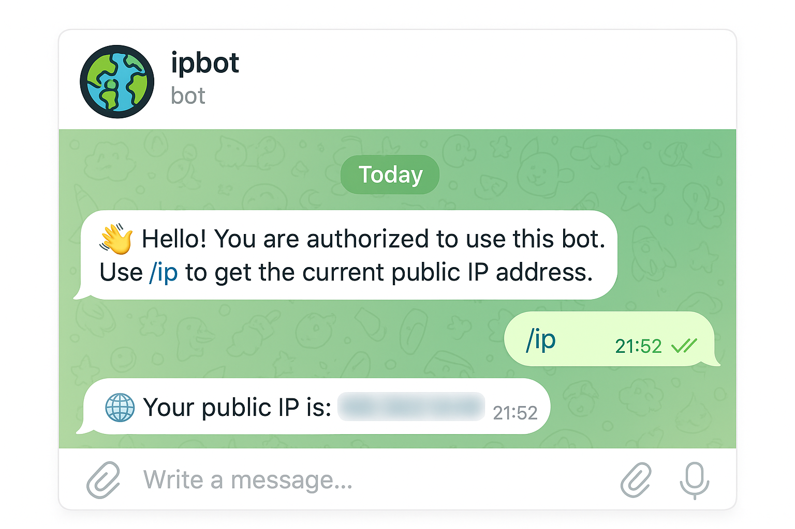

# IP Bot

[](https://github.com/elisey/ipbot/actions/workflows/ci-docker-publish.yml)

A simple async Telegram bot that responds to the `/ip` command with the public IP address of the server where the bot is running.

The bot fetches the address using external IP detection services (like api.ipify.org), works behind NAT, and restricts access to a single authorized Telegram user defined in the configuration file.



## Features

- Async Telegram bot using python-telegram-bot
- Fetches public IP from ipify API
- Authorization based on Telegram user ID
- Dockerized deployment
- Configuration via environment variables

## Quick Start

### 1. Get Your Telegram Credentials

#### Create a Telegram Bot

1. Open Telegram and search for [@BotFather](https://t.me/BotFather)
2. Send `/newbot` command
3. Follow the prompts to choose a name and username for your bot
4. BotFather will give you a token like: `123456789:ABCdefGHIjklMNOpqrsTUVwxyz`
5. Save this token - you'll need it for configuration

#### Get Your Telegram User ID

1. Open Telegram and search for [@userinfobot](https://t.me/userinfobot)
2. Send `/start` command
3. The bot will reply with your user ID (a number like `123456789`)
4. Save this ID - only this user will be able to use your IP bot

### 2. Run the Bot with Docker

#### Option 1: Use Pre-built Image from GitHub Container Registry

Pull the latest image:

```bash
# Pull the image
docker pull ghcr.io/elisey/ipbot:latest
```

Create a `.env` file with your credentials:

```bash
TELEGRAM_TOKEN=your_bot_token_here
TELEGRAM_OWNER_ID=123456789
```

Create a `docker-compose.yml` file:

```yaml
services:
  ip-bot:
    image: ghcr.io/elisey/ipbot:latest
    container_name: ipbot
    env_file:
      - .env
    restart: always
```

Start the bot:

```bash
# Start the bot
docker compose up -d

# View logs
docker compose logs -f

# Stop the bot
docker compose down
```

#### Option 2: Build Locally

Clone the repository:

```bash
git clone https://github.com/elisey/ipbot.git
cd ipbot
```

Create a `.env` file:

```bash
cp .env.example .env
# Edit .env and add your TELEGRAM_TOKEN and TELEGRAM_OWNER_ID
```

Run with docker-compose:

```bash
docker compose up -d
```

### 3. Test the Bot

Open Telegram and send `/ip` to your bot. It should respond with your public IP address.

## Configuration

The bot is configured via environment variables in the `.env` file:

- `TELEGRAM_TOKEN` (required): Your bot token from @BotFather
- `TELEGRAM_OWNER_ID` (required): Your Telegram user ID - only this user can use the bot
- `FETCHER_STRATEGY_ORDER` (optional): IP fetching strategy, default: `ipify`
- `SERVER_REPLY_FORMAT` (optional): Message format, default: `🌐 Your public IP is: {ip}`

## Troubleshooting

### Bot doesn't respond to commands

**Check your user ID:**
- Verify `TELEGRAM_OWNER_ID` in `.env` matches your actual Telegram user ID
- Get your ID from [@userinfobot](https://t.me/userinfobot) to confirm

**Check bot token:**
- Verify `TELEGRAM_TOKEN` is correct (no extra spaces)
- Test the token by visiting: `https://api.telegram.org/bot<YOUR_TOKEN>/getMe`

### "Unauthorized" message

Your Telegram user ID doesn't match `TELEGRAM_OWNER_ID` in the configuration. Only the specified owner can use the bot.

### Check logs

```bash
# View bot logs
docker compose logs -f ip-bot

# View last 100 lines
docker compose logs --tail 100 ip-bot
```

## Documentation

- **[Contributing Guide](doc/CONTRIBUTION.md)** - Development setup, testing, and architecture
- **[Deployment Guide](doc/DEPLOYMENT.md)** - Production deployment with Docker and systemd

## License

MIT
